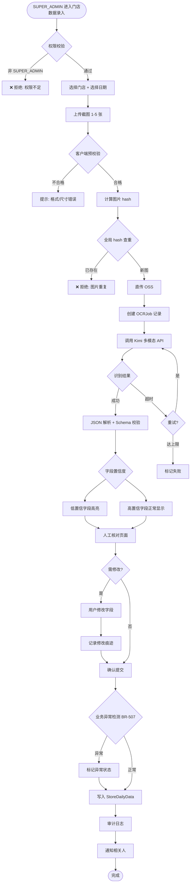

# M15 AI OCR 数据录入模块 · 详细 PRD

> **文档版本**：v1.0.0
> **最后更新**：2026-05-10
> **所属模块**：M15（独立模块，与 M14 AI 助手并列的 AI 能力模块）
> **MVP 范围**：仅门店每日经营数据录入
> **关联文档**：[requirements.md](./requirements.md) · [business-rules.md](./business-rules.md) · [ai-security.md](./ai-security.md) · [ai-tools-registry.md](./ai-tools-registry.md)

---

## 目录

1. [模块定位](#1-模块定位)
2. [核心决策](#2-核心决策)
3. [功能结构](#3-功能结构)
4. [完整业务流程](#4-完整业务流程)
5. [数据字段规范](#5-数据字段规范)
6. [AI Prompt 模板](#6-ai-prompt-模板)
7. [置信度与人工核对](#7-置信度与人工核对)
8. [反作弊机制](#8-反作弊机制)
9. [异常检测](#9-异常检测)
10. [权限与安全](#10-权限与安全)
11. [数据库设计](#11-数据库设计)
12. [工具定义](#12-工具定义)
13. [成本与配额](#13-成本与配额)
14. [前端界面](#14-前端界面)
15. [API 清单](#15-api-清单)
16. [扩展性设计](#16-扩展性设计)
17. [待确认问题](#17-待确认问题)

---

## 1. 模块定位

### 1.1 一句话定义

**M15 AI OCR 数据录入** 是一个独立的 AI 视觉能力模块，通过大模型图片识别将线下非结构化数据（如门店收银截图、合同扫描件等）转为结构化数据，**经人工核对后**入库。

### 1.2 产品定位图

```
┌─────────────────────────────────────────┐
│  AI 能力矩阵（Irys 产品体系）             │
├─────────────────────────────────────────┤
│  M14 AI 智能助手（对话型 AI）           │
│    - 文字对话                            │
│    - 数据问答                            │
│    - 工具调用                            │
│    - 操作协助                            │
├─────────────────────────────────────────┤
│  M15 AI OCR 数据录入（视觉型 AI）⭐    │
│    - 图片识别                            │
│    - 字段解析                            │
│    - 人工核对                            │
│    - 反作弊                              │
└─────────────────────────────────────────┘
     共用 Kimi K2.6 多模态 API
     共用 AIProviderConfig 配置
     共用审计日志体系
```

### 1.3 为什么是独立模块

- **能力通用**：不仅服务门店数据，未来可扩展合同 OCR、身份证 OCR、小票 OCR
- **风险独立**：图片存储、AI 成本、反作弊都是独立问题
- **权限独立**：有专属的极高权限要求（见 §10）
- **成本独立**：多模态 token 消耗与文字 AI 有数量级差异

### 1.4 与 M6.5 门店数据采集的关系

```
M6 门店管理
└─ M6.5 门店经营数据采集
    ├─ 数据渠道：API / 邮件 / 插件 / OCR / 手工
    └─ 当渠道 = OCR 时 → 调用 M15 模块
```

**M6.5 负责"数据业务语义"**（什么是门店数据、异常怎么处理）。
**M15 负责"AI OCR 技术能力"**（如何识别、如何保证质量）。

两者职责清晰分离。

---

## 2. 核心决策

以下决策在开发中不可违反（基于业务方 2026-05-10 确认）：

| 编号 | 决策 | 说明 |
|------|------|------|
| **D15-1** | **框架通用，MVP 只跑门店数据** | 代码抽象 `OCRScene`，MVP 仅实现 `STORE_DAILY_DATA` |
| **D15-2** | **10-15 个核心字段** | 营业额、订单数、客流量、客单价 + 分时段 + 支付方式分布 |
| **D15-3** | **仅最高权限角色可用** | 只有 `SUPER_ADMIN` 才能使用此功能 ⚠️ |
| **D15-4** | **单店单日录入** | 一次上传 = 一店一天数据；批量需拆分 |
| **D15-5** | **复用 Kimi K2.6 多模态** | 不引入第二家 OCR 服务商 |
| **D15-6** | **永远人工核对** | 置信度再高也必须人工确认 |

---

## 3. 功能结构

```
M15 AI OCR 数据录入
├─ M15.1 场景注册（可扩展性基础）
│   ├─ OCRScene 定义
│   ├─ Prompt 模板管理
│   └─ 字段 Schema 管理
│
├─ M15.2 图片上传与存储
│   ├─ 前端裁剪/旋转
│   ├─ 客户端预校验（尺寸、格式、大小）
│   ├─ 服务端二次校验（MIME、内容合法性）
│   ├─ 图片 hash 去重
│   ├─ OSS 直传（预签名 URL）
│   └─ 生命周期管理（冷热分离）
│
├─ M15.3 OCR 识别流程
│   ├─ Kimi 多模态调用
│   ├─ JSON 结构化输出
│   ├─ 置信度评估
│   ├─ 超时 / 失败 / 降级
│   ├─ 重试策略
│   └─ 识别结果缓存（同图 hash 命中）
│
├─ M15.4 字段解析与校验
│   ├─ Schema 校验（类型/范围/必填）
│   ├─ 金额字段精度处理
│   ├─ 日期字段标准化
│   ├─ 异常值打标
│   └─ 智能补全（可推导字段）
│
├─ M15.5 人工核对界面（强制）
│   ├─ 图片预览（可放大）
│   ├─ 识别结果表单（逐字段展示）
│   ├─ 低置信字段高亮
│   ├─ 修改痕迹追踪
│   ├─ 并列对比视图
│   └─ 提交前二次确认
│
├─ M15.6 反作弊机制
│   ├─ 图片 hash 全局去重
│   ├─ EXIF 时间戳校验
│   ├─ 图片是否带水印检测
│   ├─ 上传行为模式分析
│   ├─ 异常波动告警
│   └─ 抽查与审计
│
├─ M15.7 异常检测（业务层）
│   ├─ 同比波动阈值
│   ├─ 字段内部逻辑一致性
│   ├─ 跨数据源冲突检测
│   └─ 人工复核工作流
│
└─ M15.8 成本与配额监控
    ├─ 多模态 Token 消耗统计
    ├─ 每日/每月配额
    ├─ 预算预警
    └─ 成本看板
```

---

## 4. 完整业务流程

### 4.1 标准流程图（Happy Path）



### 4.2 异常流程

#### 场景 A：图片质量差
```
用户上传截图 → 客户端 OK → Kimi 返回 confidence < 0.5
  → 系统提示："图片质量较差，请重新上传更清晰的截图"
  → 不进入核对页面，直接重新上传
```

#### 场景 B：识别不是收银截图
```
Kimi 返回 {is_valid: false, reason: "图片不是收银系统截图"}
  → 系统提示："未识别到有效的收银数据，请检查图片内容"
  → 记录该图片（反作弊证据）
```

#### 场景 C：Kimi API 超时/失败
```
3 次重试均失败
  → 提示："AI 识别服务暂不可用，请稍后重试或选择手工录入"
  → 提供"跳过识别直接手填"入口
  → 不消耗用户配额（只消耗失败重试配额）
```

#### 场景 D：用户中途关闭页面
```
OCRJob 状态 = PENDING
  → 保留 24 小时，用户可从"我的 OCR 任务"继续
  → 超过 24 小时未确认 → 自动清理图片（OSS 省钱），状态改为 ABANDONED
```

---

## 5. 数据字段规范

### 5.1 MVP 识别字段清单（12 个）

基于决策 D15-2（10-15 个字段）：

```typescript
interface StoreDailyOCRResult {
  // === 核心指标 ===
  businessDate: string;          // YYYY-MM-DD
  totalRevenue: string;          // 总营业额（元，字符串防精度丢失）
  orderCount: number;            // 订单数
  customerCount: number;         // 客流量（桌数/人数）
  averageOrderValue: string;     // 客单价

  // === 分时段（可选）===
  timePeriods?: Array<{
    period: string;              // "11:00-14:00"
    revenue: string;
    orderCount: number;
  }>;

  // === 支付方式分布 ===
  paymentMethods?: Array<{
    method: 'WECHAT' | 'ALIPAY' | 'CASH' | 'CARD' | 'MEITUAN' | 'ELEME' | 'OTHER';
    amount: string;
    count: number;
  }>;

  // === 品类/SKU Top3（可选）===
  topSkus?: Array<{
    name: string;
    quantity: number;
    revenue: string;
  }>;

  // === 退款相关（可选）===
  refundAmount?: string;
  refundCount?: number;

  // === 元信息 ===
  confidence: number;            // 0-1，整体置信度
  fieldConfidences: Record<string, number>;  // 每个字段的置信度
  isValid: boolean;              // AI 判断是否有效截图
  invalidReason?: string;        // 无效时的原因
  detectedPosSystem?: string;    // 识别到的 POS 品牌（如"美团收银"）
}
```

### 5.2 字段验证规则

| 字段 | 类型 | 必填 | 校验规则 |
|------|------|------|---------|
| `businessDate` | string | ✅ | `YYYY-MM-DD`，不能是未来 |
| `totalRevenue` | Decimal | ✅ | `>= 0`，保留 2 位小数 |
| `orderCount` | integer | ✅ | `>= 0` |
| `customerCount` | integer | ⚠️ | `>= 0`，可为 0 但会触发异常标记 |
| `averageOrderValue` | Decimal | 自动计算 | `= totalRevenue / orderCount` |
| `paymentMethods[].amount` | Decimal | 可选 | 所有 method 之和应 ≈ totalRevenue（±1%） |
| `timePeriods[].revenue` | Decimal | 可选 | 所有 period 之和应 ≈ totalRevenue（±5%） |

### 5.3 智能补全规则

- `averageOrderValue` 未识别 → 自动计算 `totalRevenue / orderCount`
- 如果仅识别到 `paymentMethods`，`totalRevenue` 缺失 → 自动求和填充
- 识别结果字段互相矛盾时 → 全部传给用户，**用户决定**

---

## 6. AI Prompt 模板

### 6.1 门店数据识别 Prompt（MVP 版本）

```text
你是一个专业的数据录入助手，专门识别店铺 POS 收银系统的营业数据截图。

## 任务
从用户提供的一张或多张图片中，提取指定字段并以严格 JSON 格式输出。

## 背景
- 图片可能是：手机截图 / 电脑截图 / 拍摄的屏幕
- POS 系统品牌可能是：美团收银、哗啦啦、客如云、银豹、二维火、其他
- 图片中可能有中文、繁体中文、英文混排

## 输出要求

严格输出如下 JSON 结构（不要包含任何解释文字、Markdown 包装、前后缀）：

{
  "businessDate": "YYYY-MM-DD 或 null",
  "totalRevenue": "数字字符串（元，保留 2 位小数）或 null",
  "orderCount": 整数 或 null,
  "customerCount": 整数 或 null,
  "averageOrderValue": "数字字符串 或 null",
  "timePeriods": [
    { "period": "HH:MM-HH:MM", "revenue": "数字", "orderCount": 整数 }
  ] 或 null,
  "paymentMethods": [
    { "method": "WECHAT|ALIPAY|CASH|CARD|MEITUAN|ELEME|OTHER", "amount": "数字", "count": 整数 }
  ] 或 null,
  "topSkus": [
    { "name": "商品名", "quantity": 整数, "revenue": "数字" }
  ] 或 null,
  "refundAmount": "数字字符串 或 null",
  "refundCount": 整数 或 null,
  "confidence": 0到1之间的数字,
  "fieldConfidences": {
    "businessDate": 0到1,
    "totalRevenue": 0到1,
    ...（每个已识别字段都要）
  },
  "isValid": true/false,
  "invalidReason": "字符串 或 null",
  "detectedPosSystem": "识别到的系统品牌 或 null"
}

## 关键规则

1. **数字处理**
   - 去除货币符号（¥、元、￥、$）
   - 去除千分位分隔符（,）
   - 保留 2 位小数
   - 金额字段一律字符串，不用数字类型（防精度丢失）

2. **日期处理**
   - 统一输出 YYYY-MM-DD 格式
   - 如识别到"今日"、"本日"，基于图片 EXIF 时间推断
   - 如完全无法推断，设为 null 并在 confidence 扣分

3. **置信度评估**
   - confidence：整体识别把握，不是图片质量
   - fieldConfidences：每个字段的单独把握
   - 金额字段数字模糊 → 相应 fieldConfidence ≤ 0.7
   - 整体看不清 → confidence 设为 0，isValid = false

4. **isValid 判断**
   - 不是收银系统截图 → false
   - 被明显 PS 篡改痕迹 → false
   - 图片模糊到无法识别关键字段 → false
   - 多张图来自不同日期/不同店 → false，reason 说明

5. **不要做的事**
   - ❌ 不要"猜"没看清的数字
   - ❌ 不要推断未显示的数据
   - ❌ 不要为了凑字段数编造内容
   - ❌ 不要在 JSON 外输出任何文字

## 现在开始处理用户上传的图片。
```

### 6.2 Prompt 变量注入

系统实际发送时，会在 Prompt 前注入上下文：

```text
## 上下文信息（用户提供，你的识别应与此一致或标记异常）
- 门店名称：{{storeName}}
- 门店编号：{{storeCode}}
- 预期日期：{{expectedDate}}
- 该店上月日均营业额参考：{{historicalAvg}}
- 门店所在地区：{{region}}

如果识别结果与预期日期相差 > 7 天 → confidence 扣 0.3
如果识别营业额 > 上月日均 3 倍或 < 1/3 → 在 invalidReason 中说明
```

### 6.3 Prompt 版本管理

- 所有 Prompt 存入 `OCRPromptTemplate` 表
- 支持 A/B 测试（同场景多版本）
- 每次调用记录使用的 `templateVersion`
- 变更需走审批流

---

## 7. 置信度与人工核对

### 7.1 置信度阈值

```
confidence >= 0.95  → 高置信，字段默认显示
confidence >= 0.80  → 中置信，字段轻度高亮
confidence >= 0.60  → 低置信，字段红色高亮提醒
confidence <  0.60  → 强制要求用户修改或重传
```

### 7.2 核对页面必须做到

- ✅ 原图可放大预览（图片与表单并排）
- ✅ 每个字段显示置信度标记（🟢/🟡/🔴）
- ✅ 用户修改字段时立即记录（`editedFields`）
- ✅ 修改的字段不再显示 AI 置信度（避免误导）
- ✅ 提交前再次显示"所有字段已核对"提示
- ✅ 支持"标记异常"入口（即使数据正常但肉眼看图有问题）
- ✅ 支持"驳回本次识别"入口（完全不可用时）

### 7.3 修改痕迹追踪

```typescript
interface OCRReviewAudit {
  jobId: string;
  originalResult: Record<string, any>;   // AI 原始结果（快照）
  finalResult: Record<string, any>;       // 最终入库数据
  editedFields: string[];                 // 哪些字段被修改
  editDetails: Array<{
    field: string;
    originalValue: any;
    finalValue: any;
    reason?: string;
  }>;
  reviewer: string;                       // 核对人
  reviewedAt: Date;
  reviewDurationSeconds: number;          // 核对耗时（反作弊用）
}
```

### 7.4 核对时长异常检测

- 核对耗时 < 5 秒 → 告警（可能没真看就点了确认）
- 10 分钟内连续核对 > 20 次 → 告警
- 核对人与上传人相同 → 记录但允许（MVP 阶段）

---

## 8. 反作弊机制

### 8.1 MVP 必做

| 机制 | 说明 |
|------|------|
| **图片 hash 去重** | SHA-256 全局唯一，重复上传直接拒绝 |
| **EXIF 时间校验** | 图片拍摄/截图时间与营业日期相差 > 48h → 告警 |
| **AI 判断合法性** | Prompt 中要求 `isValid: false` 时拒绝入库 |
| **修改痕迹审计** | 所有 AI 结果、人工修改永久保留 |
| **操作者记录** | IP、UserAgent、设备信息全量记录 |

### 8.2 MVP 暂不做（预留字段）

| 机制 | 字段预留 | v2 实施 |
|------|---------|--------|
| 截图水印识别 | `watermarkDetected` | ✅ |
| PS 痕迹检测 | `tamperedScore` | ✅ |
| 内容重复度（不同人传同截图） | `contentSimilarityScore` | ✅ |
| 设备指纹 | `deviceFingerprint` | ✅ |

### 8.3 反作弊规则清单（代码实现）

```typescript
// 规则组：BR-1310 到 BR-1319 详见 business-rules.md

1. MD5/SHA-256 全局查重（所有上传图片）
2. 同一个 storeId 同一个 businessDate 已有数据 → 不允许再传（必须先删已有）
3. 同一个用户 1 小时内上传 > 20 张图片 → 限流
4. 同一个图片 hash 被不同用户上传 → 告警 + 审计
5. AI 判定 isValid=false 的图片保留 7 天作为证据
6. EXIF 数据被清除的图片 → 标记 "suspicious"
```

---

## 9. 异常检测

### 9.1 业务异常规则（BR-507 扩展）

录入数据提交后自动运行异常检测：

| 规则编号 | 异常条件 | 处理 |
|---------|---------|------|
| **ANML-01** | 营业额同比波动 > 50% | 标记 + 通知加盟商 + 通知运营 |
| **ANML-02** | 订单数 = 0 但营业额 > 0 | 拒绝入库 + 要求修改 |
| **ANML-03** | 客单价 > 上月平均 × 3 | 标记 + 人工复核 |
| **ANML-04** | 客单价 < 上月平均 × 1/3 | 标记 + 人工复核 |
| **ANML-05** | 支付方式金额之和与总额差异 > 1% | 标记 + 要求核对 |
| **ANML-06** | 分时段金额之和与总额差异 > 5% | 标记 + 要求核对 |
| **ANML-07** | 该日非营业日（门店状态 ≠ OPENED） | 拒绝入库 |
| **ANML-08** | 识别日期超出最近 30 天 | 要求确认 |

### 9.2 异常状态机

```
数据提交
  → 运行异常检测
    → 无异常 → APPROVED（入库可用）
    → 轻微异常 → ANOMALY_FLAGGED（入库但标记，需复核）
    → 严重异常 → REJECTED_AUTO（不入库，退回修改）
```

### 9.3 人工复核工作流

- 被标记 `ANOMALY_FLAGGED` 的数据：
  - 运营主管收到通知
  - 在"异常数据复核"页面逐条处理
  - 可选动作：确认有效 / 驳回重录 / 联系加盟商

---

## 10. 权限与安全 ⚠️

### 10.1 访问控制（核心决策 D15-3）

> **⚠️ 硬性规则**：
>
> **M15 AI OCR 数据录入功能只能由 `SUPER_ADMIN` 角色使用。**
>
> 此规则优先级高于用户的任何其他权限配置。
> 即使给其他角色分配了 `store_data:create` 权限，也不能调用此模块。

#### 10.1.1 为什么？（决策理由）

基于业务方要求："**只有最高权限的身份才能使用截图识别数据上传的功能，因为只有权限最高的身份的 AI 才能够修改数据库。**"

这反映了一个核心安全考量：**AI OCR 是一种"AI 直接写入业务数据"的能力**，必须由最可信的用户把关。

#### 10.1.2 代码层实施

```typescript
// 必须硬编码，不允许配置覆盖
const M15_ALLOWED_ROLES = ['SUPER_ADMIN'];

@Controller('ai-ocr')
@UseGuards(JwtGuard, SuperAdminOnlyGuard)  // 双层守卫
export class AIOcrController { ... }

// 同时在 Service 层二次校验
async createOCRJob(user: User, ...) {
  if (!user.roles.includes('SUPER_ADMIN')) {
    throw new ForbiddenException('M15 仅对 SUPER_ADMIN 开放');
  }
  // ...
}
```

#### 10.1.3 前端表现

- 非 `SUPER_ADMIN` 角色：
  - 门店详情页**不显示**"AI OCR 录入"按钮
  - 即使手动输入 URL 访问 → 返回 403
  - 菜单树中不渲染此入口

#### 10.1.4 未来放宽的条件（v2+）

如果未来要开放给其他角色，必须满足：
1. 建立"AI OCR 操作员"子角色
2. 通过超管授权为特定用户启用
3. 有完整的追责机制（如出事责任归属）
4. 增强反作弊检测

**v2 之前硬编码限制不可修改。**

### 10.2 图片内容安全

- 上传前：MIME 白名单（`image/jpeg`, `image/png`, `image/webp`）
- 上传前：大小限制（单张 ≤ 10MB）
- 上传后：内容审查（预留接口，v2 接入内容安全 API 防违规图片）
- 存储时：OSS 私有读，访问需签名 URL
- 访问时：签名 URL 有效期 1 小时
- 保留期：成功入库图片保留 2 年，失败图片保留 7 天

### 10.3 API Key 安全

- M15 共用 M14 的 `AIProviderConfig`
- **M15 只使用全局 Key**，不使用个人 Key（理由：M15 有写入权限，个人 Key 无此授权）
- 请求 Kimi 时 Key 短暂解密后立即释放

### 10.4 审计日志

每一次 OCR 任务生成以下审计记录：

```typescript
interface AIOcrAuditLog {
  id: string;
  userId: string;                    // 必须是 SUPER_ADMIN
  action: 'OCR_UPLOAD' | 'OCR_REVIEW' | 'OCR_CONFIRM' | 'OCR_REJECT';
  jobId: string;
  scene: OCRScene;
  targetEntity: 'Store';
  targetEntityId: string;
  imageHashes: string[];
  originalResult: object;
  finalResult?: object;
  editedFields: string[];
  aiTokens: { input: number; output: number; cost: string };
  reviewDurationSeconds: number;
  ipAddress: string;
  userAgent: string;
  createdAt: Date;
}
```

**所有 M15 审计日志永久保留，不可删除、不可修改。**

---

## 11. 数据库设计

### 11.1 Prisma Schema（新增）

```prisma
// ========== M15 AI OCR 核心表 ==========

/// OCR 任务（一次上传 = 一个 Job）
model OCRJob {
  id              String   @id @default(cuid())

  // 场景与上下文
  scene           OCRScene                                // 预留扩展
  targetEntityType String?                                // "Store"
  targetEntityId  String?                                 // 门店 ID

  // 状态
  status          OCRJobStatus  @default(PENDING)

  // 创建者
  createdBy       String                                  // 必须 SUPER_ADMIN
  createdByRole   String                                  // 快照，防角色变更丢失

  // 图片
  images          OCRImage[]

  // AI 识别
  aiProvider      String   @default("KIMI")
  aiModel         String?                                 // "kimi-k2-6-vision"
  promptVersion   String?
  inputTokens     Int?
  outputTokens    Int?
  estimatedCost   Decimal? @db.Decimal(10, 4)
  aiCalledAt      DateTime?
  aiRespondedAt   DateTime?
  aiDurationMs    Int?

  // 原始结果（快照，永不修改）
  rawResult       Json?
  overallConfidence Float?
  fieldConfidences Json?
  isValid         Boolean?
  invalidReason   String?

  // 人工核对
  reviewedBy      String?
  reviewedAt      DateTime?
  reviewDurationSeconds Int?
  finalResult     Json?
  editedFields    Json?                                   // ["totalRevenue", "orderCount"]
  editDetails     Json?

  // 最终去向
  resultStoredAt  DateTime?
  resultStoredEntityId String?                            // 如 StoreDailyData.id

  // 异常
  anomalyFlags    Json?                                   // 业务异常标记

  // 审计与反作弊
  ipAddress       String?
  userAgent       String?
  deviceInfo      Json?

  // 时间戳
  createdAt       DateTime @default(now())
  updatedAt       DateTime @updatedAt

  // 关系
  creator         User     @relation("OCRJobCreator", fields: [createdBy], references: [id])
  reviewer        User?    @relation("OCRJobReviewer", fields: [reviewedBy], references: [id])

  @@index([createdBy])
  @@index([status])
  @@index([scene, status])
  @@index([targetEntityType, targetEntityId])
  @@index([createdAt])
}

enum OCRScene {
  STORE_DAILY_DATA          // MVP 唯一场景
  CONTRACT_SCAN             // v2 预留
  ID_CARD                   // v2 预留
  BUSINESS_LICENSE          // v2 预留
  RECEIPT                   // v2 预留
}

enum OCRJobStatus {
  PENDING           // 已创建，AI 未响应
  AI_PROCESSING     // AI 识别中
  AI_FAILED         // AI 失败
  AWAITING_REVIEW   // 等待人工核对
  REVIEWING         // 核对中
  CONFIRMED         // 已确认并入库
  REJECTED          // 用户驳回
  ABANDONED         // 超时未处理
  ANOMALY_FLAGGED   // 已入库但有异常标记
}

/// OCR 图片（一个 Job 可有多张图）
model OCRImage {
  id          String   @id @default(cuid())
  jobId       String

  // 存储信息
  storageUrl  String                                     // OSS URL
  objectKey   String                                     // OSS 对象键
  fileName    String
  mimeType    String
  fileSize    Int
  width       Int?
  height      Int?

  // hash 去重
  sha256Hash  String
  md5Hash     String?

  // EXIF
  exifData    Json?
  exifTakenAt DateTime?

  // 反作弊
  watermarkDetected Boolean?
  tamperedScore     Float?                               // 预留
  contentSimilarityScore Float?                          // 预留

  // 顺序
  displayOrder Int @default(0)

  // 时间戳
  createdAt   DateTime @default(now())

  job         OCRJob   @relation(fields: [jobId], references: [id], onDelete: Cascade)

  @@unique([sha256Hash])                                 // 全局去重
  @@index([jobId])
  @@index([sha256Hash])
}

/// OCR Prompt 模板（版本化管理）
model OCRPromptTemplate {
  id          String   @id @default(cuid())
  scene       OCRScene
  version     String                                     // "v1.0.0"
  content     String   @db.Text
  variables   Json                                       // 支持的变量列表
  enabled     Boolean  @default(true)

  createdAt   DateTime @default(now())
  updatedAt   DateTime @updatedAt
  createdBy   String

  @@unique([scene, version])
  @@index([scene, enabled])
}

/// OCR 操作审计（独立于 AuditLog）
model AIOcrAuditLog {
  id              String   @id @default(cuid())
  userId          String
  action          OcrAuditAction
  jobId           String
  targetEntityType String?
  targetEntityId  String?
  details         Json
  ipAddress       String?
  userAgent       String?
  createdAt       DateTime @default(now())

  @@index([userId, createdAt])
  @@index([jobId])
}

enum OcrAuditAction {
  UPLOAD
  AI_CALLED
  AI_FAILED
  REVIEW_OPENED
  FIELD_EDITED
  CONFIRMED
  REJECTED
  ANOMALY_DETECTED
}
```

### 11.2 `StoreDailyData` 表字段补充

在现有 `StoreDailyData` 表上新增：

```prisma
model StoreDailyData {
  // ... 原有字段

  // OCR 溯源（新增）
  ocrJobId        String?                // 关联 OCRJob
  ocrJob          OCRJob?  @relation(fields: [ocrJobId], references: [id])
  ocrConfidence   Float?
  ocrEditedFields Json?
  ocrImageUrls    Json?                  // 原始图片 URL 列表

  // 已有字段 source 的值范围更新：
  // MANUAL | AI_OCR | EMAIL | API | RPA
}
```

---

## 12. 工具定义

### 12.1 新增 AI Tool

在 [ai-tools-registry.md](./ai-tools-registry.md) 中新增以下工具：

#### T31 · `ocr_parse_store_data` 🔴 HIGH (SUPER_ADMIN ONLY)

```yaml
name: ocr_parse_store_data
description: 调用 AI 视觉模型识别店铺收银截图，返回结构化数据（不直接入库）
parameters:
  type: object
  required: [imageJobId, storeId, expectedDate]
  properties:
    imageJobId:
      type: string
      description: OCRJob ID（用户已通过前端上传接口创建）
    storeId:
      type: string
      description: 门店 ID（上下文）
    expectedDate:
      type: string
      description: 预期营业日期（YYYY-MM-DD）
requireConfirmation: false   # 查询类动作，但有独立的核对流程
severity: HIGH                # 涉及高敏感写入链路
requiredRoles: [SUPER_ADMIN]  # ⚠️ 仅超管
requiredPermissions: []
returnValue:
  jobId: string
  result: StoreDailyOCRResult
  confidence: number
```

#### T32 · `submit_ocr_reviewed_data` 🔴 HIGH (SUPER_ADMIN ONLY)

```yaml
name: submit_ocr_reviewed_data
description: 人工核对后提交 OCR 识别结果入库（写入 StoreDailyData）
parameters:
  type: object
  required: [jobId, finalData]
  properties:
    jobId:
      type: string
    finalData:
      type: object
      description: 用户核对后的最终数据
    editedFields:
      type: array
      items: { type: string }
      description: 用户修改过的字段列表
    reviewDurationSeconds:
      type: integer
requireConfirmation: true
severity: HIGH
requiredRoles: [SUPER_ADMIN]
requiredPermissions: [store_data:create]
```

### 12.2 更新已有 Tool

更新 `T26 add_store_daily_data`（来自 ai-tools-registry.md）：

```yaml
# 修订点：
# - 当 source = AI_OCR 时，必须提供 ocrJobId
# - 当 source = AI_OCR 时，仅 SUPER_ADMIN 可调用
source 参数校验:
  if params.source == 'AI_OCR':
    require params.ocrJobId
    require user.role == 'SUPER_ADMIN'
```

---

## 13. 成本与配额

### 13.1 成本估算

#### Kimi K2.6 多模态定价参考

- 图片输入：每张图约 1000-3000 token（取决于分辨率）
- 文本输入（Prompt + 上下文）：约 1500 token
- 输出（JSON）：约 500-1000 token

假设每次 OCR 识别 1 张截图：

```
单次成本 ≈
  (1500 + 2000) × ¥4/M token    (输入)
+ 800 × ¥18/M token             (输出)
≈ ¥0.014 + ¥0.014
≈ ¥0.03 / 次
```

#### 年度成本场景估算

| 场景 | 每日次数 | 月成本 | 年成本 |
|------|---------|-------|-------|
| 小规模（10 店） | 10 | ¥9 | ¥110 |
| 中规模（50 店） | 50 | ¥45 | ¥540 |
| 大规模（200 店） | 200 | ¥180 | ¥2,160 |

**结论**：即使规模较大，成本都非常可控。

### 13.2 配额策略

```typescript
interface M15QuotaConfig {
  // 全局配额（所有 M15 用户共享）
  dailyImageCount: number;          // 每日最多识别几张，默认 500
  dailyCostLimit: Decimal;          // 每日金额上限，默认 ¥50

  // 单用户配额（SUPER_ADMIN）
  perUserDailyImageCount: number;   // 默认 100
  perUserDailyCostLimit: Decimal;   // 默认 ¥20

  // 熔断策略
  warningThreshold: number;         // 80% 时预警
  hardLimit: boolean;               // 达到 100% 是否直接禁用
}
```

### 13.3 成本看板

M15 独立的成本看板（仅 `SUPER_ADMIN` 可见）：

- 今日已识别张数 + 已消耗金额
- 本月趋势图
- Top 10 识别用户（MVP 只有超管，但预留）
- 失败率、平均耗时
- 异常数据率

---

## 14. 前端界面

### 14.1 入口位置

- **门店详情页**：`SUPER_ADMIN` 可见"AI 录入今日数据"按钮
- **快捷入口**：工作台右下 `SUPER_ADMIN` 专属悬浮球（与 AI 助手区分）
- **菜单**：系统 → AI OCR 数据录入

### 14.2 核心页面

#### 页面 1：上传页

```
┌────────────────────────────────────────────┐
│  AI OCR 录入 · 门店经营数据                │
├────────────────────────────────────────────┤
│                                            │
│  步骤 1：选择门店                           │
│  [下拉选择：XX 店 (ST-001)]                │
│                                            │
│  步骤 2：选择营业日期                       │
│  [日期选择器：2026-05-09]                  │
│                                            │
│  步骤 3：上传截图（1-5 张）                │
│  ┌──────────────────────────────────────┐ │
│  │  📷 点击上传 或 拖拽到此              │ │
│  │  支持 JPG/PNG/WebP，单张 ≤ 10MB      │ │
│  └──────────────────────────────────────┘ │
│                                            │
│  [已上传图片预览，可删除]                   │
│                                            │
│  ⚠️ 提示：此功能仅限集团超管使用            │
│     所有识别记录会完整审计                  │
│                                            │
│  [取消]  [开始 AI 识别]                    │
└────────────────────────────────────────────┘
```

#### 页面 2：识别中

```
┌────────────────────────────────────────────┐
│  🤖 Kimi 正在识别，请稍候...                │
│                                            │
│  [进度条：████████░░░░ 65%]                │
│  预计还需 8 秒                              │
│                                            │
│  正在处理：第 2/3 张图                      │
└────────────────────────────────────────────┘
```

#### 页面 3：核对页（关键）

```
┌───────────────────────────────────────────────────────────────┐
│  AI 识别完成 · 请仔细核对每一项                                 │
├──────────────────────────────┬────────────────────────────────┤
│                              │  🟢 门店：XX 店                │
│                              │  🟢 日期：2026-05-09           │
│                              │                                │
│     [原图 1 预览]            │  识别结果（请核对）：           │
│     [可放大 / 切换多图]      │                                │
│                              │  🟢 总营业额（AI 把握 97%）    │
│     POS 系统：美团收银        │     ¥ [8,562.50]              │
│                              │                                │
│                              │  🟡 订单数（AI 把握 82%）      │
│                              │     [127]                      │
│                              │                                │
│                              │  🔴 客流量（AI 把握 55%）     │
│                              │     [89] ⚠️ 请仔细核对         │
│                              │                                │
│                              │  [展开更多字段 ↓]              │
│                              │                                │
│                              │  💡 已检测到：                 │
│                              │  - 微信：¥5,234.00 (76 笔)    │
│                              │  - 支付宝：¥2,128.50 (32 笔)  │
│                              │  - 现金：¥1,200.00 (19 笔)    │
│                              │                                │
│                              │  ⚠️ 异常提示：                 │
│                              │  客流量较上月平均偏低 40%      │
│                              │                                │
├──────────────────────────────┴────────────────────────────────┤
│  [重新识别] [驳回不入库] [返回修改] [✓ 确认无误，提交入库]     │
└───────────────────────────────────────────────────────────────┘
```

#### 页面 4：确认弹窗（提交前最后一步）

```
┌──────────────────────────────────────────┐
│  ⚠️ 确认提交                              │
├──────────────────────────────────────────┤
│                                          │
│  您已核对以下字段：                       │
│  ✓ 总营业额：¥8,562.50                   │
│  ✓ 订单数：127                           │
│  ✓ 客流量：89                            │
│  ✓ ... 共 12 项                          │
│                                          │
│  修改过的字段：                           │
│  📝 订单数：AI 识别 125 → 已改为 127     │
│  📝 客流量：AI 识别 78 → 已改为 89       │
│                                          │
│  ⚠️ 提交后将：                            │
│  - 写入门店每日数据表                     │
│  - 触发异常检测（客流量偏低）             │
│  - 通知相关加盟商与运营                   │
│  - 完整审计日志                           │
│                                          │
│  [返回再核对]         [确认提交]          │
└──────────────────────────────────────────┘
```

---

## 15. API 清单

新增 API（详细定义放在 Phase 4 的 `api-contract.md`）：

| 方法 | 路径 | 描述 | 权限 |
|------|------|------|------|
| `POST` | `/ai-ocr/jobs` | 创建 OCR 任务（上传图片） | SUPER_ADMIN |
| `GET` | `/ai-ocr/jobs` | 我的 OCR 任务列表 | SUPER_ADMIN |
| `GET` | `/ai-ocr/jobs/:id` | 获取任务详情 | SUPER_ADMIN |
| `POST` | `/ai-ocr/jobs/:id/recognize` | 触发 AI 识别 | SUPER_ADMIN |
| `POST` | `/ai-ocr/jobs/:id/confirm` | 提交核对结果 | SUPER_ADMIN |
| `POST` | `/ai-ocr/jobs/:id/reject` | 驳回本次识别 | SUPER_ADMIN |
| `GET` | `/ai-ocr/jobs/:id/images/:imageId` | 下载图片（签名 URL） | SUPER_ADMIN |
| `GET` | `/ai-ocr/scenes` | 可用场景列表 | SUPER_ADMIN |
| `GET` | `/ai-ocr/stats` | M15 使用统计 | SUPER_ADMIN |
| `GET` | `/ai-ocr/audits` | M15 审计日志查询 | SUPER_ADMIN |

---

## 16. 扩展性设计

### 16.1 场景扩展（v2+）

基于决策 D15-1（框架通用），以下为预留扩展点：

```typescript
enum OCRScene {
  STORE_DAILY_DATA          // ✅ MVP
  CONTRACT_SCAN             // 合同扫描件 OCR
  ID_CARD                   // 身份证识别
  BUSINESS_LICENSE          // 营业执照识别
  BANK_RECEIPT              // 转账凭证识别
  MENU                      // 菜单识别
  POS_RECEIPT               // 小票识别
}
```

每个场景需要：
- 独立的 Prompt 模板
- 独立的字段 Schema
- 独立的校验规则
- 独立的入库逻辑

框架层（上传、存储、AI 调用、核对、审计）**完全复用**。

### 16.2 模型扩展（v2+）

虽然 MVP 只用 Kimi，但抽象了 `OCRProvider` 接口：

```typescript
interface OCRProvider {
  name: string;                                    // "KIMI_K26_VISION"
  recognize(images: Buffer[], prompt: string): Promise<OCRRawResult>;
  estimateCost(imageSize: number): Decimal;
}
```

未来可加：
- `AliyunQwenVLProvider`
- `DoubaoVLProvider`
- `AnthropicClaudeVisionProvider`
- `OpenAIGpt4vProvider`

### 16.3 权限扩展（v2+）

MVP 仅 `SUPER_ADMIN`，v2 后可：
- 建立"OCR 操作员"子角色
- 按场景开放（"仅合同 OCR 开放给财务"）
- 加盟商自助上传自己门店数据（但需审核）

---

## 17. 待确认问题

新增到 `docs/open-questions.md` 的 Q13XX 系列：

### 🟡 Q1301 · 同一门店同日重复上传如何处理？
**默认假设**：先删已有记录（带审批），才能传新的。

### 🟡 Q1302 · 识别失败的图片保留多久？
**默认假设**：成功 2 年，失败 7 天。

### 🟡 Q1303 · 核对耗时 < 5 秒是否阻止提交？
**默认假设**：MVP 不阻止，仅告警。v2 考虑强制最小核对时长。

### 🟡 Q1304 · 用户修改了超过一半字段，是否要求重新识别？
**默认假设**：不强制，但标记"严重编辑"，审计重点关注。

### 🟡 Q1305 · 是否支持取消已入库的 OCR 数据？
**默认假设**：24 小时内可撤销（需超管二次确认），审计保留。

### 🟡 Q1306 · 是否支持在识别前先粘贴 EXIF 时间做预校验？
**默认假设**：MVP 不做，上传后统一校验。

### 🟢 Q1307 · 是否支持语音辅助输入（超管边看边说）？
**默认假设**：v2 考虑。

### 🟢 Q1308 · 是否支持 OCR 识别结果的批量对比（同日多店）？
**默认假设**：v2 考虑，属于数据分析范畴。

### 🟡 Q1309 · 如果 Kimi K2.6 不可用，降级到哪个模型？
**默认假设**：MVP 不做降级，直接报错并提供手工录入入口。

### 🟡 Q1310 · 如何处理多语言店招（海外分店）？
**默认假设**：MVP 仅支持中英文。v2 处理其他语言。

---

## 附录 A · 开发排期

建议在 **Phase 7 Sprint 6 之后** 单独做一个 Sprint：

```
Sprint 8（AI OCR）· 5 个工作日

Day 1: 数据库 migration + OCRScene 抽象层
Day 2: 图片上传与存储（OSS 直传、hash 去重）
Day 3: Kimi 多模态调用 + Prompt 模板管理
Day 4: 核对页面 UI + 修改痕迹追踪
Day 5: 权限守卫 + 异常检测 + 审计 + 联调

验收：SUPER_ADMIN 能完整走通上传 → 识别 → 核对 → 入库流程
```

## 附录 B · 测试清单

必测场景：

- [ ] 非 SUPER_ADMIN 访问 → 403
- [ ] 正确识别流程（happy path）
- [ ] 低置信度字段强制高亮
- [ ] 重复图片 hash → 拒绝
- [ ] AI 返回 isValid=false → 拒绝入库
- [ ] 核对耗时过短 → 告警
- [ ] 同店同日重复提交 → 拒绝
- [ ] 支付方式金额不匹配 → 异常标记
- [ ] 超配额 → 熔断
- [ ] Kimi 超时 → 重试 3 次后失败
- [ ] 审计日志完整性
- [ ] 图片签名 URL 过期后不可访问

## 附录 C · 版本记录

| 版本 | 日期 | 变更 |
|------|------|------|
| v1.0.0 | 2026-05-10 | 初版，基于业务方 6 项决策 |
