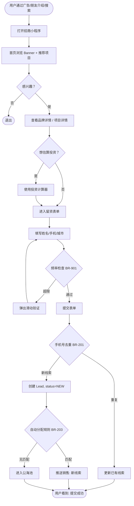
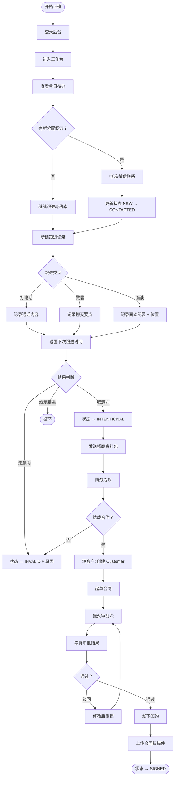
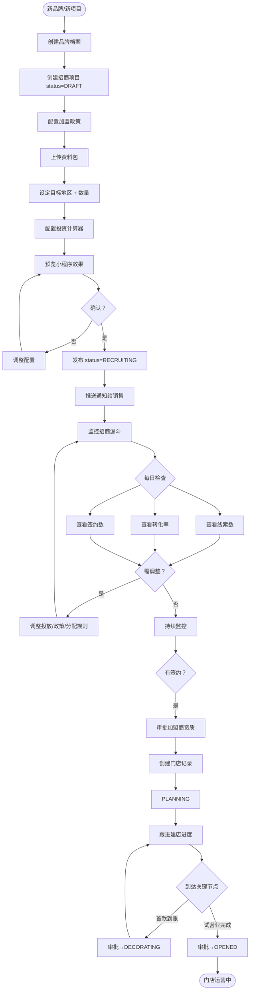
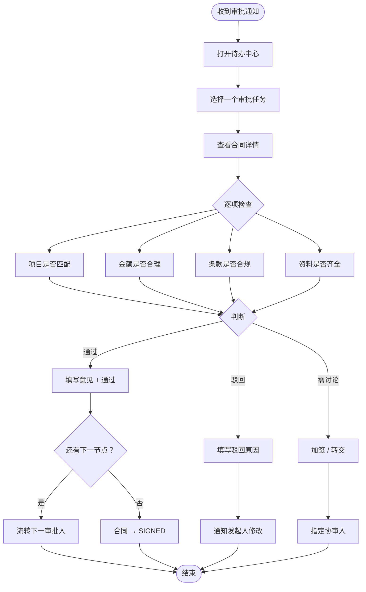
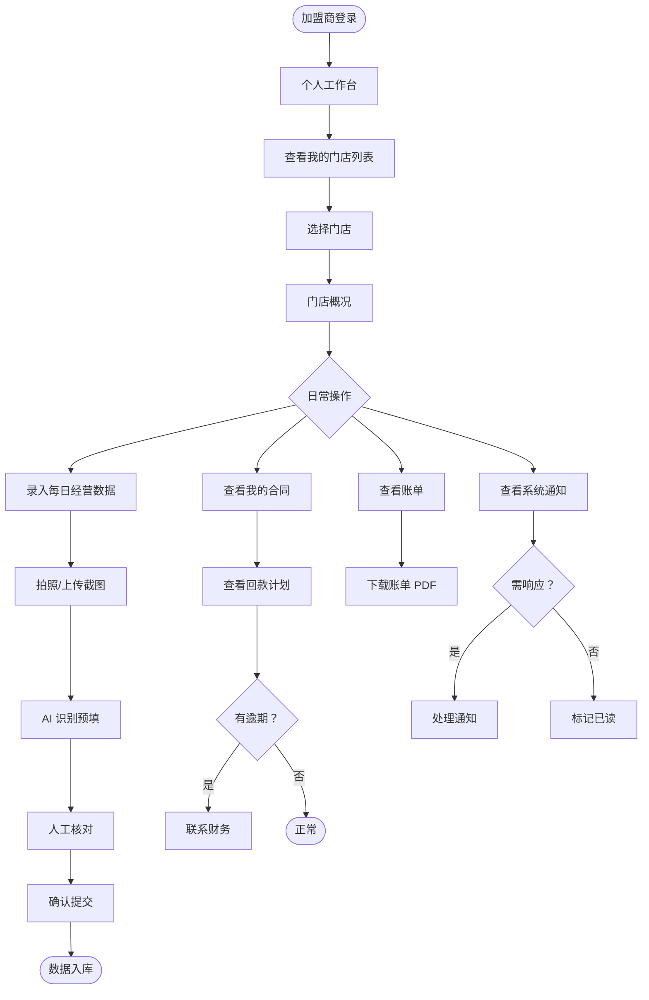
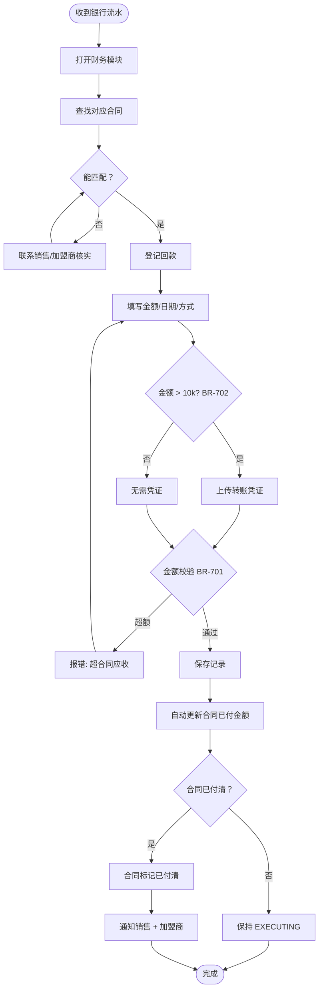
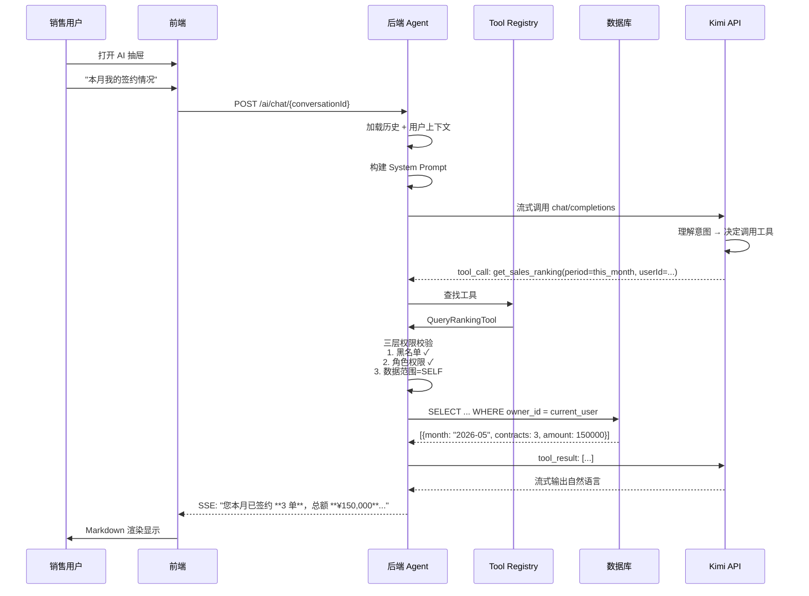
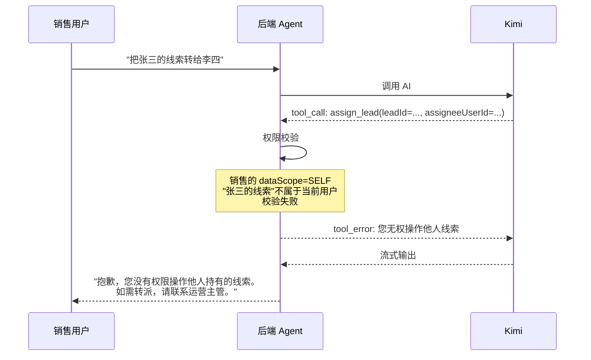
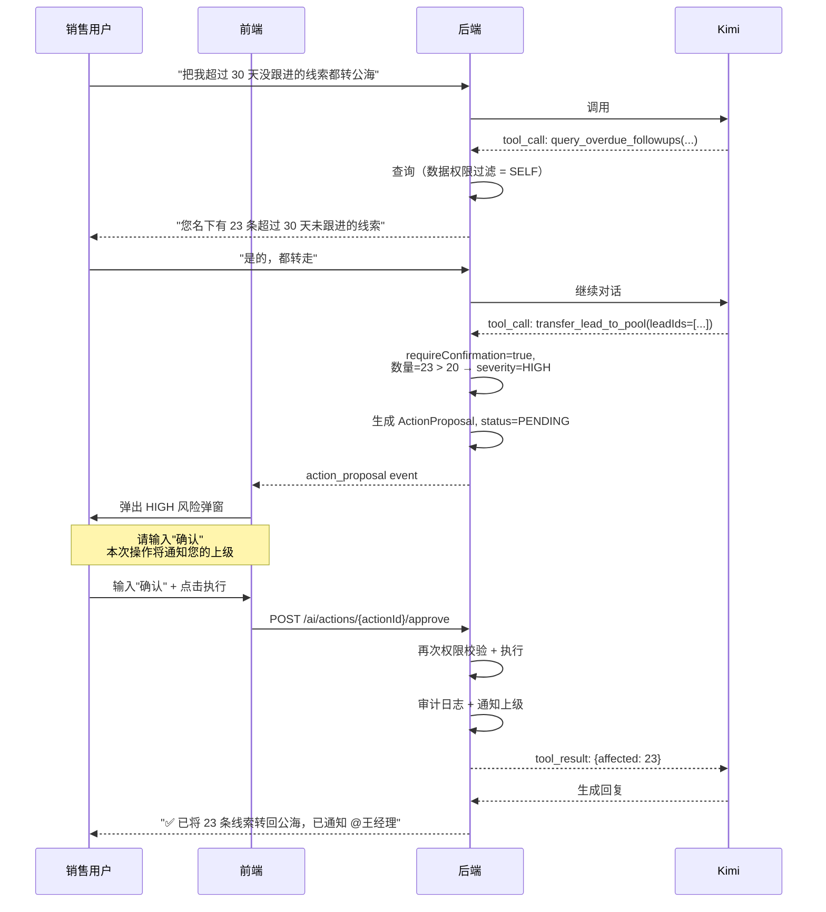
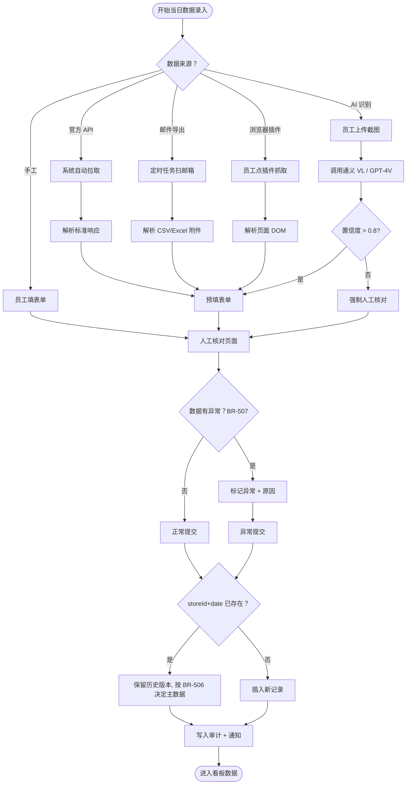

# 用户旅程（User Journeys）

> **文档版本**：v1.0.0
> **最后更新**：2026-05-10
>
> 用 Mermaid 流程图描述每个角色的关键旅程。
> 这是**业务流程的可视化源头**，状态机、API 设计都以此为依据。

---

## 目录

1. [C 端用户：浏览到留资](#1-c-端用户浏览到留资)
2. [招商顾问：线索跟进全流程](#2-招商顾问线索跟进全流程)
3. [运营主管：项目与门店管理](#3-运营主管项目与门店管理)
4. [审批人：合同审批](#4-审批人合同审批)
5. [加盟商：自助门店管理](#5-加盟商自助门店管理)
6. [财务：回款登记](#6-财务回款登记)
7. [用户与 AI 助手交互](#7-用户与-ai-助手交互)
8. [门店数据录入（多渠道）](#8-门店数据录入多渠道)

---

## 1. C 端用户：浏览到留资

### 路径：公众发现品牌 → 小程序浏览 → 留资 → 后台跟进

### 异常流
- 网络异常 → 表单自动本地缓存，恢复后自动重试
- 手机号已是客户 → 提示"您已是我们的客户，是否联系负责的 @XX"
- 位置获取失败 → 降级为手动选择城市

---

## 2. 招商顾问：线索跟进全流程

### 路径：接收线索 → 跟进 → 意向确认 → 转客户 → 推合同

### 关键规则
- BR-202 状态机
- BR-204 超期回公海
- BR-207 跟进不可删
- BR-208 转客户条件

---

## 3. 运营主管：项目与门店管理

### 路径：配置招商项目 → 发布小程序 → 跟踪进展 → 门店开业

---

## 4. 审批人：合同审批

---

## 5. 加盟商：自助门店管理

---

## 6. 财务：回款登记

---

## 7. 用户与 AI 助手交互

### 场景：销售问"本月我的签约情况"

### 场景：销售问"把张三的线索转给李四"（越权）

### 场景：销售请求批量转公海（高风险）

---

## 8. 门店数据录入（多渠道）

---

## 附录：旅程关联的 API 预览

| 旅程 | 关键 API |
|------|---------|
| 1. C 端留资 | `POST /mini/leads` |
| 2. 销售跟进 | `PATCH /leads/:id/status` `POST /leads/:id/followups` |
| 3. 运营管理 | `POST /projects` `PATCH /stores/:id/status` |
| 4. 审批 | `POST /approvals/:id/approve` `POST /approvals/:id/reject` |
| 5. 加盟商 | `GET /merchant/me/stores` `POST /stores/:id/daily-data` |
| 6. 财务 | `POST /contracts/:id/payments` |
| 7. AI 交互 | `POST /ai/chat` `POST /ai/actions/:id/approve` |
| 8. 数据录入 | `POST /stores/:id/daily-data` `POST /ai/ocr/store-data` |

完整 API 定义将在 Phase 4 产出到 `docs/api-contract.md`。
